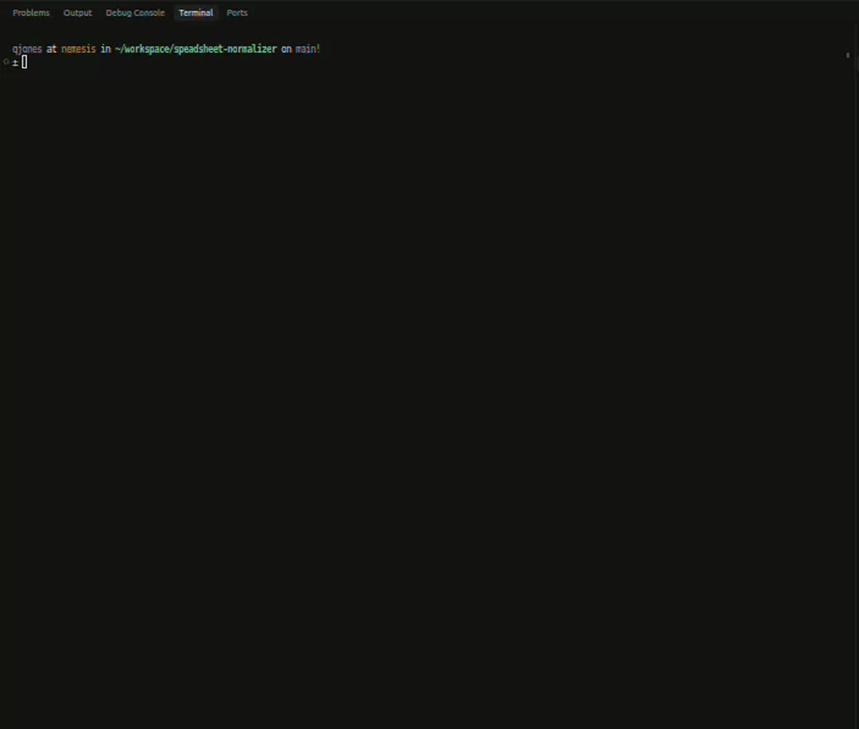

# Spreadsheet normalizer (portfolio POC)

Small, synthetic example of taking a messy export, normalizing it for Airtable-style tables, and documenting field mapping plus verification—the same shape of work as spreadsheet to clean CSV to linked import.

No third-party dependencies: Python 3.10+ stdlib only.

## What’s included

| Path | Purpose |
|------|---------|
| `data/messy_orders.csv` | Fake orders with messy dates, casing, spacing, merged amount/status, mixed `location` vs `city`/`state`, duplicate `order_id`, and one Excel-style serial date. |
| `scripts/normalize.py` | Reads the messy file, applies rules, writes `clean/`. |
| `clean/orders.csv`, `clean/customers.csv` | Airtable-oriented outputs (customers deduped by `customer_key`; orders reference that key for linking). |
| `clean/normalization_report.txt` | Row counts plus any validation flags when rules or data disagree. |
| `docs/field-map.md` | Column mapping: source → Airtable field types and import order. |
| `docs/normalization-rules.md` | Plain-language rule list suitable for stakeholder sign-off. |
| `docs/verification-checklist.md` | Pre/post checklist for migrations. |
| `RUNBOOK.md` | How to run the normalizer, verify output, and recover from common issues. |
| `assets/spreadsheet-normalizer-demo.gif` | Short screen walkthrough (from `assets/Screencast from 2026-05-14 11-33-14.webm`). |
| `scripts/export-demo-gif.sh` | Optional: re-export a WebM/MP4 recording as a palette-optimized README GIF (requires `ffmpeg`). |

## Demo



[](https://youtu.be/5kP0q89-kFk)

## Run

```bash
python scripts/normalize.py
```

Step-by-step instructions, success checks, and troubleshooting: **[RUNBOOK.md](RUNBOOK.md)**.

Committed `clean/` outputs match a fresh run so reviewers can skim without executing anything.

## For clients / proposals

You can describe this repo as:

- Review & map columns to the target schema (see `docs/field-map.md`).
- Encode normalization rules in code **or** in a playbook—here it’s explicit in `scripts/normalize.py` plus `docs/normalization-rules.md`.
- Produce samples, run QA (`docs/verification-checklist.md`), then scale to full import.

All data here is fabricated and can be replaced with sanitized samples under NDA for a specific engagement.

